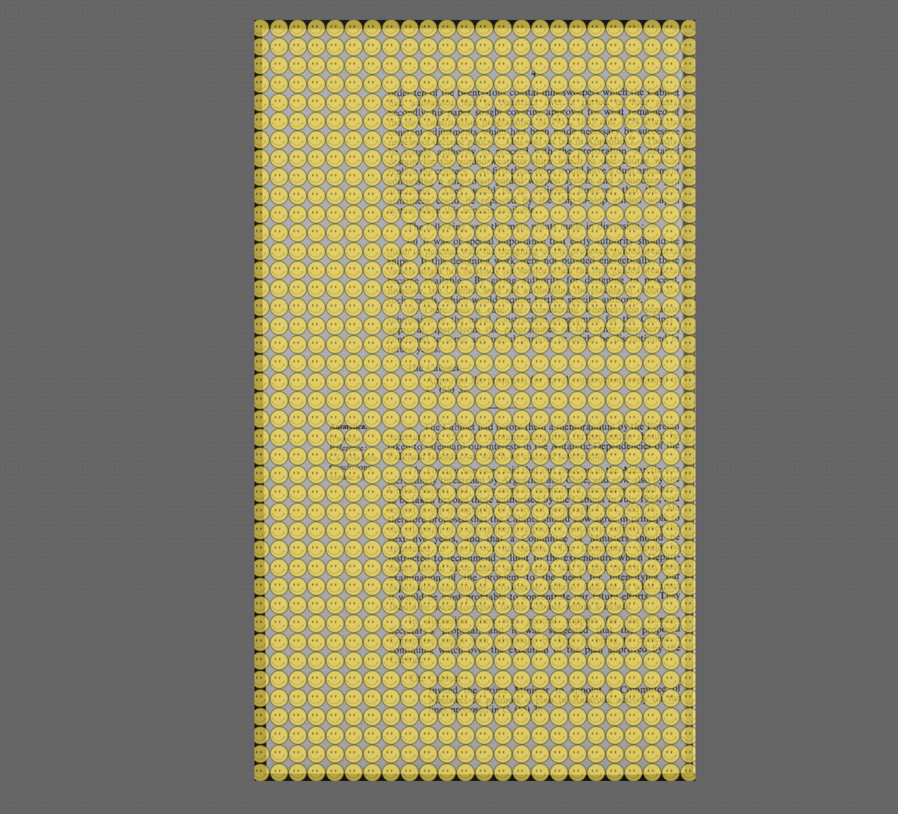

# IIIF Watermark Server

Adds a watermark on top of a IIIF Image API server call via a node proxy server. This can be useful if you only want to display content depending on a certain condition, if you want to easily add your logo to raw images, or if you just want watermarking while preserving IIIF functionality. 

To run this server:

1. Clone this repo to your machine.
2. Install [graphicsMagick](https://github.com/aheckmann/gm) to allow your machine to watermark images on the fly.
3. Run `npm install` in the root of this projects folder.
4. Point all your `manifest.json` images to this mock servers port (4343)
5. Run `node server.js`
6. Your IIIF images will appear watermarked with the `watermark.png` file.

This has been tested with TIFY, Mirador and Universal viewer.

Modify the height/width of `watermark.png` or use the [sharp API](http://sharp.pixelplumbing.com/en/stable/api-composite/) to change how the watermark appears.

If you need to easily setup a working IIIF server with images, use the [image viewer comparison](https://github.com/nationalarchives/image-viewer-comparison) repo from [@nationalarchives](http://github.com/nationalarchives)

## Performance

- Using TIFY, a 6477 x 9727 Map with a 6.1MB file size loaded in 10 seconds without the watermark, and 12.5 seconds with the watermark.

- There is currently caching enabled on this proxy server, set to 60 minutes.

## Known issues

- If you have large images, a watermarked thumbnail will not be generated as the thumbnail may be smaller 
than the size of your watermark, which sharp does not allow. To solve this, I have set the server to just send an unwatermarked image if this happens.

## Other

Credits for the smiley face used goes to [wikipedia](https://en.wikipedia.org/wiki/Smiley#/media/File:SNice.svg)
